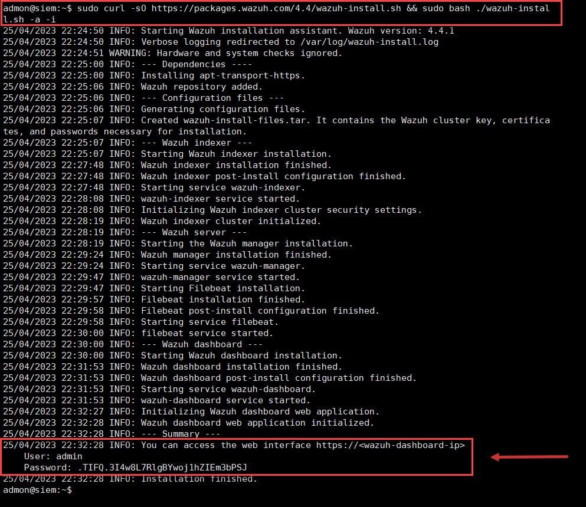

# 2. Instalación Wazuh
A continuación, presentaremos una guía de instalación de Wazuh en el sistema operativo Ubuntu 22.04.


Todos los pasos que se describen a continuación están basados en la documentación de Wazuh, la cual pueden encontrar en su sitio web oficial: [Instalación de Wazuh](https://documentation.wazuh.com/current/installation-guide/index.html).

## Preparación del servidor
A continuación, presentamos los requerimientos necesarios para la instalación de Wazuh:
- Sistema Operativo Linux: 
  - Amazon Linux 2
  - CentOS 7, 8
  - Red Hat Enterprise Linux 7, 8, 9
  - Ubuntu 16.04, 18.04, 20.04, 22.04
- Navegador web (Firefox, chrome o edge)
- Cliente SSH [Putty](https://the.earth.li/~sgtatham/putty/latest/w64/putty.exe)
- Memoria RAM, CPU y Almacenamiento, de acuerdo con la cantidad de agentes(endpoint) a instalar

| Agentes | CPU | RAM | Almacenamiento (90 días) |
|-----------|-----------|-----------|-----------|
| 1-25 | 4 vCPU | 8 GiB | 50 GB |
| 25-50 | 8 vCPU | 8 GiB | 100 GB |
| 50-100 | 8 vCPU | 8 GiB | 200 GB |


## Proceso de instalación
Abrir una consola de conexión SSH haciendo uso del programa putty, y establecer conexión con la máquina virtual creada para alojar el servidor de wazuh, a traves de la conexión: admon@192.168.1.100 y la contraseña asignada en el proceso de instalación.


En la línea de comandos vamos a ejecutar el siguiente comando que realizara la descarga del instalador e inmediatamente realizara la instalación del software wazuh :

```sudo curl -sO https://packages.wazuh.com/4.14/wazuh-install.sh && sudo bash ./wazuh-install.sh -a```


Para el caso del presente laboratorio, nuestra maquina no cuenta con los requerimientos mínimos exigidos para la operación, así que nos presentara una advertencia por falta de recursos.

Si deseamos continuar con la instalación haciendo caso omiso de la advertencia, basta con agregar el parámetro ```-i``` a la anterior línea, y al ejecutarla iniciara inmediatamente la instalación.

```sudo curl -sO https://packages.wazuh.com/4.14/wazuh-install.sh && sudo bash ./wazuh-install.sh -a -i```



El comando anterior se encargará de iniciar la instalación de los componentes necesarios para el funcionamiento de wazuh, y al finalizar la instalación, presentara el nombre de usuario y contraseña para la administración de la plataforma; este proceso puede durar entre 7 y 10 minutos.

Para el caso de este laboratorio el instalador nos presenta que nos ha asignado un usuario y una contraseña similar a como se presentan a continuación:

```
User: admin
Password: .TIFQ.3I4w8L7RlgBYwoj1hZIEm3bPSJ
```

Ahora basta con acceder a traves de un navegador web a la plataforma de wazuh: **https://192.168.1.100**, como se muestra a continuación
